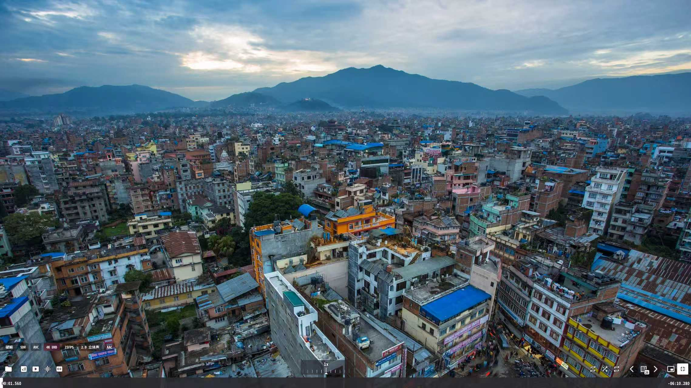
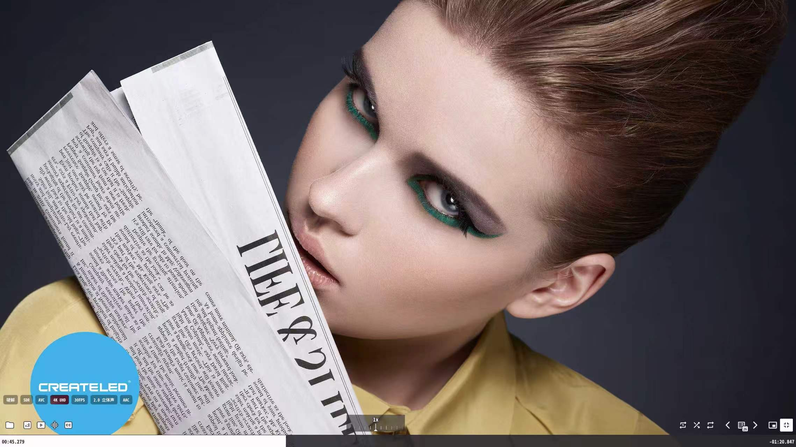
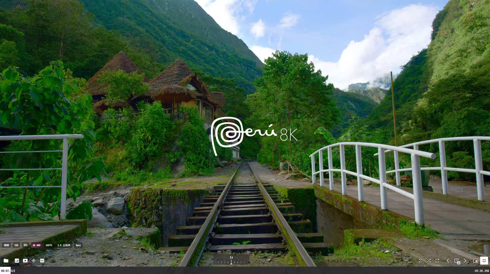

# 🎬 uosc Video Tags 视频技术标签模块

[](https://github.com/yosh-wang/uosc-video-tags/stargazers)
[](https://github.com/yosh-wang/uosc-video-tags/forks)
[](https://github.com/yosh-wang/uosc-video-tags/watchers)

[](https://github.com/yosh-wang/uosc-video-tags/stargazers)
[](https://github.com/yosh-wang/uosc-video-tags/forks)
[](https://github.com/yosh-wang/uosc-video-tags/issues)
[](https://github.com/yosh-wang/uosc-video-tags/watchers)
[](https://github.com/yosh-wang/uosc-video-tags/graphs/contributors)
[](https://github.com/yosh-wang/uosc-video-tags/blob/main/LICENSE)

[](https://github.com/yosh-wang/uosc-video-tags/releases/latest)
[](https://github.com/yosh-wang/uosc-video-tags/tags)
[](https://github.com/yosh-wang/uosc-video-tags/releases)
[](https://github.com/yosh-wang/uosc-video-tags/releases/latest)
[](https://github.com/yosh-wang/uosc-video-tags/releases)
[](https://github.com/yosh-wang/uosc-video-tags/blob/main/LICENSE)

[](https://github.com/yosh-wang/uosc-video-tags/commits/main)
[](https://github.com/yosh-wang/uosc-video-tags/commits/main)
[](https://github.com/yosh-wang/uosc-video-tags/commits/main)
[](https://github.com/yosh-wang/uosc-video-tags/commits/main)
[](https://github.com/yosh-wang/uosc-video-tags/graphs/contributors)
[](https://github.com/yosh-wang/uosc-video-tags/graphs/contributors)

[](https://github.com/yosh-wang/uosc-video-tags)
[](https://github.com/yosh-wang/uosc-video-tags)
[](https://github.com/yosh-wang/uosc-video-tags)
[](https://github.com/yosh-wang/uosc-video-tags)
[](https://github.com/yosh-wang/uosc-video-tags)
[](https://github.com/yosh-wang/uosc-video-tags)


---

🎬 MPV播放器·硬核技术交流群

🎬 极致画质/杜比视界/HDR直通/滤镜/脚本/AI字幕/弹幕全配置/ Github开源免费

🎯 群内已有 800 多名 MPV 爱好者（玩家 / Github开发者 / 配置党）

📌 QQ 群号：1097053691

🔗 点击链接加入：https://qm.qq.com/q/KQZsl4wFmG

群友：[杳知](https://github.com/Yaozhil) 原创      群友：寻 二创，适配 [dyphire](https://github.com/dyphire/mpv-config)整合包：

感谢二位的付出.

---

🎬 **为 [uosc](https://github.com/tomasklaen/uosc) 播放器界面添加视频/音频技术参数标签**

在播放器左下角（控制栏上方）实时显示当前媒体的编码、分辨率、HDR、音频等信息。

**完全独立模块 · 不修改 uosc 核心代码 · 更新 uosc 时只需复制模块代码**

---

## 📖 项目简介

| 项目 | 信息 |
|------|------|
| 适用脚本 | uosc |
| 当前版本 | v1.0.0 |
| 兼容 uosc 版本 | 5.12.0+ |
| 配置文件 | `script-opts/mediainfo.conf` |
| 语言 | 中文 (简/繁) / 英文 |

---

## ✨ 功能特性

### 0. 视频开始时自动显示标签

播放视频时，标签会自动显示并停留一段时间，帮助用户快速了解当前视频的技术参数。

- **默认显示 5 秒**后自动淡出
- **可自定义显示时长**（`mediainfo_initial_display`）
- **平滑淡出动画**，不突兀

```ini
# 视频开始时自动显示 5 秒，0 为关闭此功能
mediainfo_initial_display=5
```

### 1. 完整的技术参数覆盖

| 类别 | 显示内容 | 示例 |
|------|----------|------|
| 🎬 **解码方式** | 硬解 / 软解 | `硬解` |
| 🌈 **HDR 类型** | SDR / HDR10 / HDR10+ / HLG / Dolby Vision / HDR Vivid | `HDR10+` |
| 📹 **视频编码** | AVC / HEVC / AV1 / VP9 | `HEVC` |
| 📺 **分辨率等级** | 8K UHD / 4K UHD / 2K QHD / 1080P / 720P | `4K UHD` |
| ⚡ **帧率** | 整数 FPS | `60FPS` |
| 🔊 **音频声道** | 7.1 / 5.1 / 2.0 / 1.0 | `5.1 环绕声` |
| 🎵 **音频编码** | AAC / FLAC / DTS / DTS-HD / TrueHD / Audio Vivid 等 | `DTS-HD` |

---

### 2. 智能识别国产影音标准

- **HDR Vivid（菁彩影像）**：通过 ffprobe 深度检测，自动显示 `HDR Vivid (菁彩影像)`
- **Audio Vivid（菁彩音频）**：检测音轨关键词，自动显示 `Audio Vivid 菁彩音频`

---

### 3. 智能高亮渐变背景

- 🔥 HDR 类（Dolby Vision / HDR Vivid / HDR10+）
- 📺 高分辨率（4K UHD / 8K UHD）
- 🎵 高品质音频（TrueHD / DTS-HD）

**内置 17 种渐变主题可选**，支持手动调色。

---

### 4. 非侵入式设计

- 不修改 uosc 核心代码，纯追加模块
- 更新 uosc 时只需复制模块代码到新版末尾
- 独立配置文件 `mediainfo.conf`

---

## 📸 预览效果





---
## 📥 安装

### 文件结构

```
portable_config/
├── scripts/
│   └── uosc/
│       └── main.lua          ← 添加模块代码
├── script-opts/
│   └── mediainfo.conf        ← 配置文件
└── mpv.conf
```

### 安装步骤

1. 下载 `mediainfo.conf` 放到 `script-opts/` 目录
2. 下载 `main.lua` 放到 `mpv_config\portable_config\scripts\uosc/` 目录
3. 可选：确保 ffprobe 可用（用于 HDR Vivid 识别）

---

## ⚙️ 配置项

```ini
# 启用/禁用标签显示 (yes/no)
mediainfo_enabled=yes

# 视频开始时自动显示时长 (秒)，0 为关闭此功能
mediainfo_initial_display=5

# 尺寸配置
# 字体大小 (scale 倍数，原版 9.8，1.2倍 12，1.5倍 14)
mediainfo_font_size=12

# 距离控制栏偏移 (越大标签越靠上)
mediainfo_y_offset=23

# 标签间距
mediainfo_gap=5

# 左右内边距
mediainfo_x_padding=6

# 上下内边距
mediainfo_y_padding=3

# 缩放配置
mediainfo_scale_intensity=0.30

# 渐变主题
mediainfo_theme=bbblurry

# 缩放强度 (0.0=不缩放  0.5=半缩放  1.0=完全跟随窗口)
mediainfo_scale_intensity=0.30

# 渐变主题 (高亮标签背景) 共17个
# bbblurry / lavender / amethyst / sapphire / midnight
# crimson / magenta / amber / gold / bubblegum
# blush / coral / plasma / electric / autumn / rust / aurora
# custom - 手动调色
mediainfo_theme=bbblurry

```

---

## 📜 许可证

MIT License

---

**由 好友 寻 提供技术支持， [yosh-wang](https://github.com/yosh-wang) 用 ❤️ 制作**

⭐ 如果这个项目对您有帮助，请给一个 Star 支持一下！
