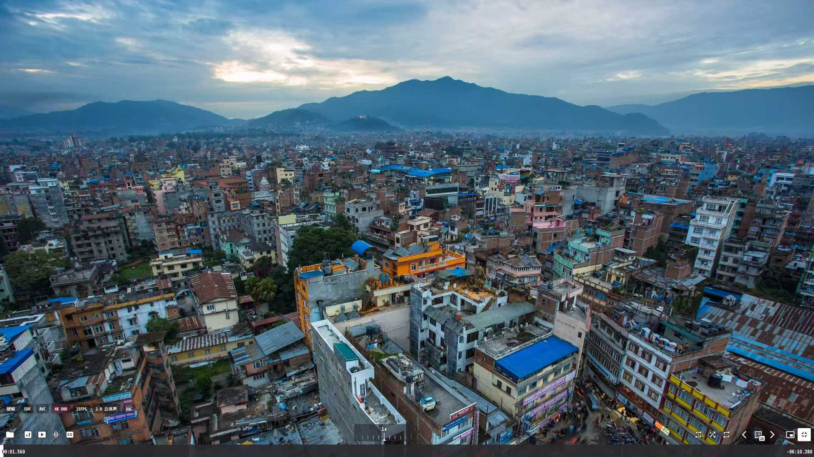
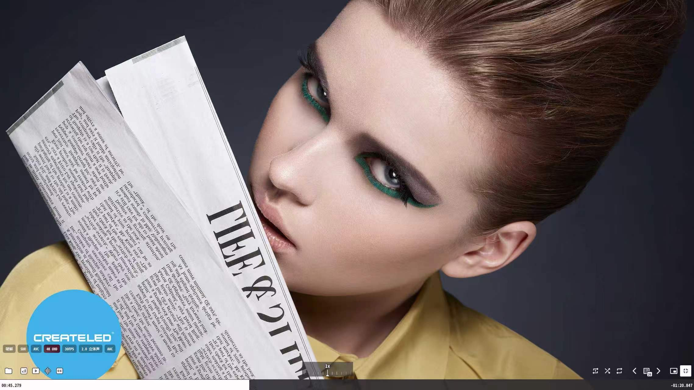
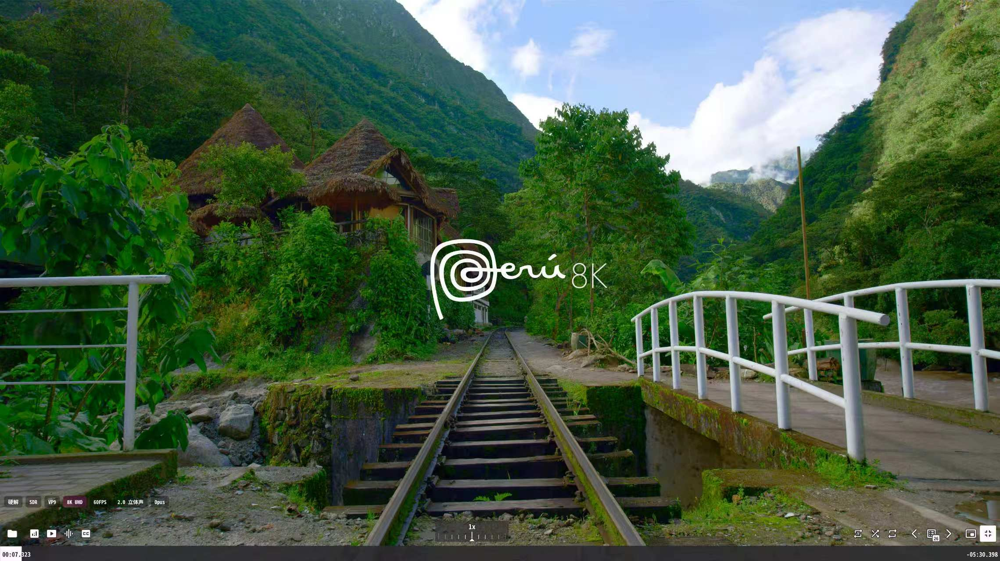

# 🎬 MPV Player · 硬核技术交流群

[](https://qm.qq.com/q/KQZsl4wFmG) 
[](https://qm.qq.com/q/KQZsl4wFmG)          [](https://qm.qq.com/q/KDxk01ukwe)
[](https://qm.qq.com/q/KDxk01ukwe)

---
> **🎯 mpv · 为画质而生，为技术而狂 · mpv 🎯**
---

## 📌 群信息

<table>
  <tr>
    <td width="50%" valign="top" style="padding: 0;">
      <table>
        <tr><td><strong>QQ ①群</strong></td><td><a href="https://qm.qq.com/q/KQZsl4wFmG">1097053691</a></td></tr>
        <tr><td><strong>QQ ②群</strong></td><td><a href="https://qm.qq.com/q/KDxk01ukwe">1104144778</a></td></tr>
        <tr><td><strong>群成员</strong></td><td>2000，36+</td></tr>
        <tr><td><strong>群性质</strong></td><td>热心发电·免费交流</td></tr>
        <tr><td><strong>分享内容</strong></td><td>配置/脚本/着色器/懒人包</td></tr>
        <tr><td><strong>适合人群</strong></td><td>新手入门·玩家折腾·开发交流</td></tr>
        <tr><td><strong>群目标</strong></td><td>互助·分享·共同折腾</td></tr>
        <tr><td><strong>进群暗号</strong></td><td>mpv 玩家</td></tr>
      </table>
    </td>
    <td width="50%" align="center" valign="top" style="padding: 0;">
      <table>
        <tr>
          <td align="center">
            
          </td>
          <td align="center">
            
          </td>
        </tr>
      </table>
    </td>
  </tr>
</table>

---
# 🎬 uosc Video Tags 视频技术标签模块

[](https://github.com/yosh-wang/uosc-video-tags/stargazers)
[](https://github.com/yosh-wang/uosc-video-tags/forks)
[](https://github.com/yosh-wang/uosc-video-tags/watchers)

[](https://github.com/yosh-wang/uosc-video-tags/stargazers)
[](https://github.com/yosh-wang/uosc-video-tags/forks)
[](https://github.com/yosh-wang/uosc-video-tags/issues)
[](https://github.com/yosh-wang/uosc-video-tags/watchers)
[](https://github.com/yosh-wang/uosc-video-tags/graphs/contributors)
[](https://github.com/yosh-wang/uosc-video-tags/blob/main/LICENSE)

[](https://github.com/yosh-wang/uosc-video-tags/releases/latest)
[](https://github.com/yosh-wang/uosc-video-tags/tags)
[](https://github.com/yosh-wang/uosc-video-tags/releases)
[](https://github.com/yosh-wang/uosc-video-tags/releases/latest)
[](https://github.com/yosh-wang/uosc-video-tags/releases)
[](https://github.com/yosh-wang/uosc-video-tags/blob/main/LICENSE)

[](https://github.com/yosh-wang/uosc-video-tags/commits/main)
[](https://github.com/yosh-wang/uosc-video-tags/commits/main)
[](https://github.com/yosh-wang/uosc-video-tags/commits/main)
[](https://github.com/yosh-wang/uosc-video-tags/commits/main)
[](https://github.com/yosh-wang/uosc-video-tags/graphs/contributors)
[](https://github.com/yosh-wang/uosc-video-tags/graphs/contributors)

[](https://github.com/yosh-wang/uosc-video-tags)
[](https://github.com/yosh-wang/uosc-video-tags)
[](https://github.com/yosh-wang/uosc-video-tags)
[](https://github.com/yosh-wang/uosc-video-tags)
[](https://github.com/yosh-wang/uosc-video-tags)
[](https://github.com/yosh-wang/uosc-video-tags)


---

## 📌 群友：[杳知](https://github.com/Yaozhil) 原创 ，  样式参考 "寻"  ， 本人二次修改 加工          

---


## 🎬 已经适配：[dyphire/mpv-config](https://github.com/dyphire/mpv-config) 整合包

为 [uosc](https://github.com/tomasklaen/uosc) 播放器界面添加视频/音频技术参数标签
在播放器左下角（控制栏上方）实时显示当前媒体的编码、分辨率、HDR、音频等信息。

**完全独立模块 · 不修改 uosc 核心代码 · 更新 uosc 时只需复制模块代码**

---
## 📖 项目简介
| 项目 | 信息 |
|------|------|
| 适用脚本 | uosc |
| 当前版本 | v7.0 |
| 兼容 uosc 版本 | [uosc](https://github.com/dyphire/mpv-config/tree/master/scripts/uosc) |
| 配置文件 | `script-opts/mediainfo.conf` |
| 语言 | 中文 (简/繁) / 英文 |
| 依赖 | 无（单文件自包含，无需 ffprobe 或外部模块） |
---
## ✨ 功能特性
### 1. 视频开始时自动显示标签
播放视频时，标签会自动显示并停留一段时间，帮助用户快速了解当前视频的技术参数。
- **默认显示 5 秒**后自动淡出
- **可自定义显示时长**（`mediainfo_initial_display`）
- **平滑淡出动画**，不突兀
```ini
# 视频开始时自动显示 5 秒，0 为关闭此功能
mediainfo_initial_display=5
```
### 2. 完整的技术参数覆盖
| 类别 | 显示内容 | 示例 |
|------|----------|------|
| 🎬 **解码方式** | 硬解 / 软解 | `硬解` |
| 🌈 **HDR 类型** | SDR / HDR10 / HDR10+ / HLG / Dolby Vision / HDR Vivid | `HDR10+` |
| 📹 **视频编码** | AVC / HEVC / AV1 / VP9 / VVC / AVS3 | `HEVC` |
| 📺 **分辨率等级** | 8K UHD / 4K UHD / 2K QHD / 1080P / 720P | `4K UHD` |
| ⚡ **帧率** | 整数 FPS | `60FPS` |
| 🔊 **音频声道** | 7.1 / 5.1 / 2.0 / 1.0 | `5.1 环绕声` |
| 🎵 **音频编码** | AAC / FLAC / DTS / DTS-HD MA / TrueHD / Audio Vivid 等 | `DTS-HD MA` |

**标签显示顺序（固定）：**
```
硬解/软解 → HDR → 编码 → 音频编码 → 音频声道 → 分辨率 → 帧率
```
---
### 3. 智能识别国产影音标准
- **HDR Vivid（菁彩影像）**：通过 mpv 属性 `video-params/hdr-vivid` + 音轨元数据 + 文件名多重检测，自动显示 `HDR Vivid (菁彩影像)`
- **Audio Vivid（菁彩音频）**：检测音轨关键词，自动显示 `Audio Vivid 菁彩音频`
- **无需 ffprobe**，纯 mpv 属性检测，同步且可靠
---
### 4. 智能高亮渐变背景
- 🔥 HDR 类（Dolby Vision / HDR Vivid / HDR10+）
- 📺 高分辨率（4K UHD / 8K UHD）
- 🎵 高品质音频（TrueHD / DTS-HD MA / DTS-HD HRA）
- 🔊 环绕声（5.1 环绕声 / 7.1 环绕声 及以上）
- ⚡ 高帧率（60FPS 及以上）

**内置 17 种渐变主题可选**，支持手动调色。
---
### 5. 非侵入式设计
- 独立单文件 `MediaInfo.lua`，不修改 uosc 核心代码
- `main.lua` 仅末尾追加一行加载代码
- 更新 uosc 时只需保留 3 个文件，无需重新集成
- 独立配置文件 `mediainfo.conf`
---
## 📸 预览效果





---
## 📥 安装
### 文件结构
```
portable_config/
├── scripts/
│   └── uosc/
│       ├── elements/
│       │   └── MediaInfo.lua    ← 标签脚本（独立单文件）
│       └── main.lua             ← 末尾追加一行加载代码
├── script-opts/
│   └── mediainfo.conf           ← 配置文件
└── mpv.conf
```
### 安装步骤
1. 下载 `MediaInfo.lua` 放到 `scripts/uosc/elements/` 目录
2. 下载 `mediainfo.conf` 放到 `script-opts/` 目录
3. 在 `scripts/uosc/main.lua` 末尾追加一行：
```lua
require('elements/MediaInfo'):new()
```

> **提示**：无需 ffprobe，无需外部模块，3 个文件即可使用。

### 更新 uosc 时的迁移方法
更新 uosc 后，只需保留以下 3 个文件：
1. `scripts/uosc/elements/MediaInfo.lua` — 放回 `elements/` 目录
2. `script-opts/mediainfo.conf` — 放回 `script-opts/` 目录
3. 在新版 `main.lua` 末尾加一行 `require('elements/MediaInfo'):new()`
---
## 🏷️ 标签说明

> **⭐ = 高亮标签** —— 渐变主题底（bbblurry）+ 光斑模糊 + 白色加粗文字
> **无标记 = 普通标签** —— 配置色底（默认 `000000`）+ 35% 透明度 + 白色加粗文字

### 标签显示顺序

<kbd>硬解 / 软解</kbd> → <kbd>分辨率</kbd> → <kbd>动态范围</kbd> → <kbd>视频编码</kbd> → <kbd>音频编码</kbd> → <kbd>音频声道</kbd> → <kbd>帧率</kbd>

---

### 1. 解码方式 &nbsp;`hwdec`

根据 `hwdec-current` 属性判断当前是硬件解码还是软件解码。

⭐<kbd>硬解</kbd>　　<kbd>软解</kbd>

- **判定逻辑**　`hwdec-current` 非空且不为 `no` → 硬解；否则 → 软解
- **高亮**　「硬解」高亮（渐变主题底）；「软解」不高亮（普通标签底色）

---

### 2. 分辨率 &nbsp;`res`

根据 `video-params` 中的宽高判定分辨率等级，通过 `video-frame-info.interlaced` 检测隔行扫描。

⭐<kbd>8K UHD</kbd>　⭐<kbd>4K UHD</kbd>　<kbd>2K QHD</kbd>　<kbd>1080P</kbd>　<kbd>1080i</kbd>　<kbd>720P</kbd>　<kbd>720i</kbd>　<kbd>576P</kbd>　<kbd>576i</kbd>　<kbd>480P</kbd>　<kbd>480i</kbd>　<kbd>360P</kbd>

- **高亮（2 种）**　4K UHD（宽 ≥ 3800 或 高 ≥ 2100）、8K UHD（宽 ≥ 7600 或 高 ≥ 4300）
- **不高亮**　2K QHD、1080P / 1080i、720P / 720i 及以下
- **隔行检测**　读取 `video-frame-info.interlaced`，`true` 时后缀为 `i`（如 1080i），`false` 时为 `P`（如 1080P）
- **转换规则**　`1440P QHD` → `2K QHD`

---

### 3. 动态范围 &nbsp;`hdr`

检测优先级：Dolby Vision → HDR Vivid → HDR10+ → HLG → HDR10 → HDR → SDR。**SDR 仍然会显示，只是不高亮。**

⭐<kbd>Dolby Vision (P5)</kbd>　⭐<kbd>Dolby Vision (P7)</kbd>　⭐<kbd>Dolby Vision</kbd>　⭐<kbd>HDR Vivid (菁彩影像)</kbd>　⭐<kbd>HDR10+</kbd>　⭐<kbd>HDR10</kbd>　⭐<kbd>HLG</kbd>　⭐<kbd>HDR</kbd>　<kbd>SDR</kbd>

- **高亮（8 种）**　Dolby Vision (P5)、Dolby Vision (P7)、Dolby Vision、HDR Vivid (菁彩影像)、HDR10+、HDR10、HLG、HDR
  - 包含关键词：`Dolby Vision` / `Vivid` / `菁彩` / `HDR10` / `HLG` / `HDR`
- **不高亮**　SDR（仍然会显示在标签行中）
- **转换规则**　`HDR Vivid` → `HDR Vivid (菁彩影像)`；`Dolby Vision P5` → `Dolby Vision (P5)`

---

### 4. 视频编码 &nbsp;`codec`

只从真实视频轨与解码器信息匹配：`video-codec` / `track.codec` / `demux-codec` / `codec-desc` / `decoder-desc` / `track.format`。**不使用文件名** —— 避免片源转码后文件名残留旧编码（例如 AV1 转码后文件名仍带 x265）造成误标。

⭐<kbd>VVC</kbd>　⭐<kbd>AVS3</kbd>　⭐<kbd>AV1</kbd>　<kbd>HEVC</kbd>　<kbd>AVC</kbd>　<kbd>EVC</kbd>　<kbd>AVS2</kbd>　<kbd>AVS+</kbd>　<kbd>VP9</kbd>　<kbd>VP8</kbd>　<kbd>MPEG-2</kbd>　<kbd>MPEG-4</kbd>　<kbd>VC-1</kbd>　<kbd>ProRes</kbd>　<kbd>Theora</kbd>　<kbd>JPEG XL</kbd>　<kbd>WebP</kbd>

- **高亮（3 种）**　VVC、AVS3、AV1 —— 下一代编码标准
- **不高亮（14 种）**　HEVC、AVC 等主流及旧编码
- **无转换**　检测结果直接显示

---

### 5. 音频编码 &nbsp;`audio_codec`

从 `track-list` / `audio-codec` / metadata 中匹配音频编码格式。

⭐<kbd>Dolby Atmos</kbd>　⭐<kbd>DTS:X</kbd>　⭐<kbd>TrueHD</kbd>　⭐<kbd>DTS-HD MA</kbd>　⭐<kbd>DTS-HD HRA</kbd>　⭐<kbd>DTS</kbd>　⭐<kbd>Dolby AC-4</kbd>　⭐<kbd>MPEG-H Audio</kbd>　⭐<kbd>FLAC</kbd>　⭐<kbd>ALAC</kbd>　⭐<kbd>Audio Vivid 菁彩音频</kbd>　<kbd>Dolby Digital Plus</kbd>　<kbd>Dolby Digital</kbd>　<kbd>HE-AAC v2</kbd>　<kbd>HE-AAC</kbd>　<kbd>DAB+</kbd>　<kbd>WavPack</kbd>　<kbd>TAK</kbd>　<kbd>TTA</kbd>　<kbd>APE</kbd>　<kbd>WMA</kbd>　<kbd>Opus</kbd>　<kbd>Vorbis</kbd>　<kbd>AAC</kbd>　<kbd>MP3</kbd>　<kbd>PCM</kbd>　<kbd>MLP</kbd>

- **高亮（11 种）**　Dolby Atmos、DTS:X、TrueHD、DTS-HD MA、DTS-HD HRA、DTS（精确匹配）、Dolby AC-4、MPEG-H Audio、FLAC、ALAC、Audio Vivid 菁彩音频
- **高亮判定说明**　`DTS-HD` 为前缀匹配，DTS-HD MA 与 DTS-HD HRA 都会高亮
- **不高亮（17 种）**　Dolby Digital 系列、AAC 系列、Opus、Vorbis、MP3、PCM 等
- **转换规则**　`Dolby TrueHD` → `TrueHD`；`Audio Vivid` → `Audio Vivid 菁彩音频`

---

### 6. 音频声道 &nbsp;`audio_ch`

**检测顺序**：`audio-params` 布局 → 输出声道数 → 音轨 demux 元数据 → 文件名兜底（最末一道）。
音频直通时（SPDIF / IEC61937 载体）跳过输出声道数，只信任音轨真实声道。

⭐<kbd>7.1 环绕声</kbd>　⭐<kbd>5.1 环绕声</kbd>　⭐<kbd>X.Y.Z 环绕声</kbd>　⭐<kbd>6声道</kbd>　⭐<kbd>8声道</kbd>　<kbd>2.0 立体声</kbd>　<kbd>1.0 单声道</kbd>　<kbd>3声道</kbd>　<kbd>4声道</kbd>　<kbd>2声道</kbd>　<kbd>1声道</kbd>

- **高亮**　包含「环绕声」的标签；「N声道」格式中 N ≥ 6（即 5.1 以上规格）
- **不高亮**　「2.0 立体声」、「1.0 单声道」、N < 6 的「N声道」
- **转换规则**　`7.1` → `7.1 环绕声`；`5.1` → `5.1 环绕声`；`2.0` → `2.0 立体声`；`1.0` → `1.0 单声道`；`6ch` → `6声道`
- **直通保护**　开启音频直通后，传输载体常被报成 2 声道；此时按音轨真实声道显示，不会误标「2.0 立体声」

---

### 7. 帧率 &nbsp;`fps`

读取 `estimated-vf-fps`，回退到 `container-fps`，统一取整显示。

⭐<kbd>60FPS</kbd>　⭐<kbd>90FPS</kbd>　⭐<kbd>120FPS</kbd>　⭐<kbd>144FPS</kbd>　⭐<kbd>240FPS</kbd>　<kbd>24FPS</kbd>　<kbd>25FPS</kbd>　<kbd>30FPS</kbd>　<kbd>48FPS</kbd>　<kbd>50FPS</kbd>

- **高亮**　FPS ≥ 60
- **不高亮**　FPS < 60
- **转换规则**　统一取整（23.976FPS → 24FPS、29.97FPS → 30FPS）

---
## 📜 许可证
MIT License
---

⭐ 如果这个项目对您有帮助，请给一个 Star 支持一下！
